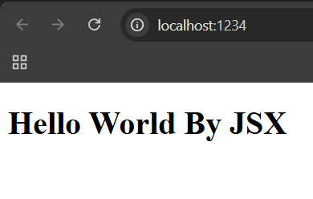
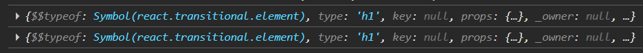
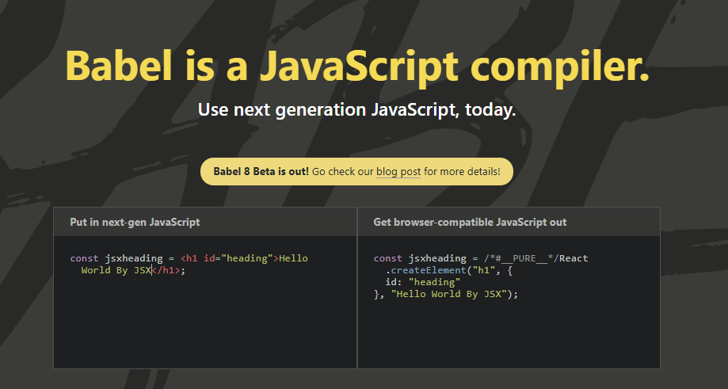

# ⚛️ React Chapter-5 : JSX Made Life Easy

In this chapter, we explore how JSX revolutionized the way we build UIs, making our code more readable, maintainable, and developer-friendly.

---

## 🛠️ 1. Making Professional Scripts

Instead of typing long commands in the terminal every time to run our project, we define scripts in our `package.json` file.

### 📌 Updating package.json

```json
"scripts": {
    "start": "parcel src/index.html",
    "build": "parcel build src/index.html",
    "test": "jest"
}
```

### 📌 How to run them?

From now on, we will use these shorthand commands:

- **To start the project:** Run `npm start` (or `npm run start`). This triggers the Parcel development server.
- **To build the project:** Run `npm run build`. This creates a production-ready bundle.

> **Note:** While `npm start` works directly for the start script, for most other scripts (like `build`), you must use the `run` keyword.

---

## 🤯 2. The Problem with Complexity

As we saw in previous chapters, creating elements using `React.createElement` is hard to maintain.

Imagine building a real-world application with:

- 15-20 nested HTML elements.
- Complex CSS classes.
- Dynamic scripting logic.

Doing this manually with `createElement` leads to a "Nesting Hell" that is hard to read and even harder to debug.

### 📌 The Origin of JSX

To solve this, the team at Facebook (now Meta) introduced JSX in 2013 alongside React. The goal was simple:

- Combine UI + Logic in one place.
- Make the code look like the final output (HTML).
- Improve the overall developer experience.

---

## ⚛️ 3. What is JSX?

JSX (JavaScript XML) is a syntax extension for JavaScript. It allows us to write HTML-like code directly inside our JavaScript files.

### 📌 Myths vs. Reality

- ❌ **Myth:** JSX is just HTML inside JS.
- ✅ **Reality:** JSX is an HTML-like or XML-like syntax that gets compiled into JavaScript.

### 📌 Creating JSX

In your `app.js`, you can now write:

```jsx
const jsxheading = <h1 id="heading">Hello World By JSX</h1>;
```

This looks like HTML, but it's assigned to a JavaScript variable. But wait... is this valid JavaScript? Let's try to render it, assuming that it is same as `heading` created with `createElement`:

```js
root.render(jsxheading);
```



Yes it worked! The code is way more readable and easy to write and define. Amazing. But HOW???

---

## 🧙‍♂️ 4. The Magic Behind JSX (Babel)

### 📌 So, how does it run? Is JSX valid Javascript?

So JSX is not JavaScript. JavaScript does not come with JSX inside it from core — the JavaScript engine in your browser (like V8) does not understand JSX. The JavaScript engine only understands standards defined in ECMAScript.

For example, when we print this in the browser console:

```js
const jsxheading = <h1 id="heading">Hello World By Aryan</h1>;
```

It will be a **Syntax Error**. The browser doesn't even know what this is. Then how does the rendering happen without an error? So who is behind those things?

### Yes, it's Parcel.

Parcel uses a tool called **Babel** behind the scenes.

- Babel is a JavaScript Compiler.
- It takes your JSX code and "transpiles" (converts) it into `React.createElement` calls that the browser can understand.

### 📌 The Proof (Console Log Comparison)

If we log both versions in `app.js`:

```jsx
const heading = React.createElement("h1", { id: "heading" }, "Hello World");
const jsxheading = <h1 id="heading">Hello World By JSX</h1>;

console.log(heading);
console.log(jsxheading);
```

**Output:**

Both are the exact same things. Just a difference of readability and complexity. In the end, JSX is transpiled into `createElement` and as we discussed already in Chapter-2, it's just a JavaScript Object.

**You can visit [babeljs.io](https://babeljs.io/) to check what the code is internally converted to by giving your JSX to its testing compiler.It takes next-gen JS and gives you browser compatible Js**



Babel does many things as well — you can explore it.

---

## 🚀 5. Power Features of JSX

### 📌 1. Multi-line JSX

If you want to write multiple lines of JSX, you must wrap them in parentheses `( )`. This helps JavaScript understand where the block starts and ends.

```jsx
const multilineJSX = (
  <div id="parent">
    <div id="child1">
      <h1>I Am Heading 1</h1>
      <h2>I Am Heading 2</h2>
    </div>
    <div id="child2">
      <h1>I Am Heading 1</h1>
      <h2>I Am Heading 2</h2>
    </div>
  </div>
);
```

### 📌 2. JavaScript inside JSX (The Curly Braces)

This is the "Superpower" of JSX. You can execute any JavaScript expression directly inside your UI using `{ }`.

```js
const number = 3000;
const text = (
  <div>
    <h1>Here we can also add any JavaScript using curly braces:</h1>
    {console.log("Hello! I am running inside JSX")}
    <p>Sum of 100 + 200 is: {100 + 200}</p>
    <h2>{"JSX is Amazing!"}</h2>
    <h2>{number}</h2>
  </div>
);
```

### 📌 3. Attribute Differences

Because JSX is JavaScript, we cannot use reserved JS keywords as attributes.

- Instead of `class`, we use `className`.
- Instead of `tabindex`, we use `tabIndex`.

> **Important:** All attributes in JSX follow **camelCase** naming conventions.

---

## ✅ Summary

- JSX is NOT HTML, but it looks like it to make our lives easier.
- Babel (managed by Parcel) is the secret engine that converts JSX into `React.createElement`.
- Everything in React eventually becomes a JavaScript Object before it hits the DOM.

##### From now on, we will leave `createElement` behind and use JSX for everything!

> In next chapter we will explore What is component in react andthe importance of components
